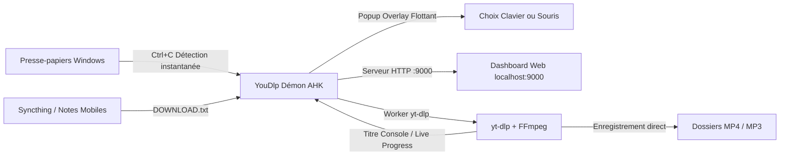

# 🎬 YouDlp-Dashboard - Serveur & Dashboard Local Ultra-Rapide

Un gestionnaire de téléchargement YouTube moderne, beau, léger et ultra-rapide piloté par `yt-dlp` et disposant d'une interface web soignée. Conçu pour Windows, il tourne en arrière-plan avec une empreinte mémoire minuscule (~20 Mo de RAM), surveille le presse-papiers sans ralentissement et permet un contrôle direct de vos fichiers multimédias locaux.

---

## 📦 Les 2 Éditions Disponibles

YouDlp Dashboard est désormais distribué en 2 éditions adaptées à tous les usages (disponibles dans la racine et dans le dossier [`Release/`](file:///e:/Reste/Faut%20Trier/YouDlp-Dashboard/Release/)) :

| Édition | Fichier | Taille | Caractéristiques |
| :--- | :--- | :--- | :--- |
| **⭐ Standalone (Full)** | [`YouDlp-Dashboard-Standalone.exe`](file:///e:/Reste/Faut%20Trier/YouDlp-Dashboard/Release/YouDlp-Dashboard-Standalone.exe) | ~111 Mo | **100% Autonome & Clé en main**. Embarque nativement **`yt-dlp.exe`**, **`ffmpeg.exe`** et l'interface Web. Aucune installation requise : placez le fichier dans n'importe quel dossier et lancez-le ! Tout se configure automatiquement. |
| **⚡ Lite (Système)** | [`YouDlp-Dashboard-Lite.exe`](file:///e:/Reste/Faut%20Trier/YouDlp-Dashboard/Release/YouDlp-Dashboard-Lite.exe) | ~1.4 Mo | **Ultra-léger**. Embarque uniquement le code du tableau de bord et s'appuie sur `yt-dlp` et `ffmpeg` déjà présents dans votre PATH Windows. |

> [!TIP]
> Le fichier [`YouDlp-Dashboard.exe`](file:///e:/Reste/Faut%20Trier/YouDlp-Dashboard/YouDlp-Dashboard.exe) situé à la racine est identique à la version **Standalone**. Double-cliquez dessus et tout fonctionne immédiatement !

---

## 🔄 Vérification Hebdomadaire & Mise à Jour Autonome de yt-dlp

YouDlp Dashboard intègre un système robuste et intelligent de gestion des versions :
1. **Vérification automatique hebdomadaire (tous les 7 jours)** :
   - L'application vérifie discrètement (6 secondes après le démarrage, puis toutes les 24h) si 7 jours se sont écoulés depuis la dernière analyse.
   - Si c'est le cas, elle interroge l'API GitHub officielle de `yt-dlp`.
   - Si une nouvelle version est détectée, une boîte de dialogue conviviale vous **propose la mise à jour** (Oui / Non).
2. **Fonctionnement garanti pour l'utilisateur Standalone** :
   - Lorsque vous acceptez la mise à jour (ou si vous cliquez sur **🔄 Vérifier / Mettre à jour yt-dlp** dans l'interface), le fichier `bin\yt-dlp.exe` est téléchargé et mis à jour directement sur votre disque.
   - **L'exécutable fonctionne IMMÉDIATEMENT avec la nouvelle version**, sans avoir besoin d'AutoHotkey, de compilateur, ni d'aucun outil de développement externe !
   - Si l'environnement de développement AutoHotkey est présent, l'application ré-empaquète également les `.exe` du dossier `Release/`.
3. **Mise à jour manuelle en 1 clic** :
   - Depuis le Dashboard Web (icône ⚙ Paramètres > **🔄 Vérifier / Mettre à jour yt-dlp**).
   - Depuis la barre des tâches : clic droit sur l'icône Tray > **🔄 Mettre à jour et ré-empaqueter yt-dlp**.

---

## 🔔 Gestion Silencieuse des Notifications

Pour les utilisateurs préférant un fonctionnement 100% silencieux sans bulles système Windows :
- **Désactivation en 1 clic** : cochez ou décochez l'option dans la fenêtre des Paramètres (icône ⚙) du Dashboard Web, ou via le menu de la barre des tâches (clic droit sur l'icône Tray > **🔔 Notifications système**).
- Lorsque l'option est désactivée, **aucune bulle de notification (TrayTip)** n'apparaît, rendant l'application parfaitement discrète.

---

## ✨ Fonctionnement et Architecture

### 1. Démon Backend (`main.ahk` - AutoHotkey v1)
- **Démarrage silencieux** : Se loge en barre des tâches sans popups intempestifs ni ouverture forcée du navigateur.
- **Surveillance Presse-papiers non-bloquante** : Détecte les URLs YouTube (vidéos, shorts, playlists) en moins de 5 ms.
- **Popup Flottant Hybride (Clavier & Souris)** :
  - `[ ← ]` ou Clic sur **MP4 (Vidéo)** : Ajoute la vidéo à la file.
  - `[ → ]` ou Clic sur **MP3 (Audio)** : Ajoute l'audio à la file.
  - `[ ↓ ]` ou Clic sur **Options Web** : Ouvre le dashboard avec l'URL pré-remplie.
  - `[ Échap ]` : Ignore et ferme la fenêtre.
  - Minuterie de fermeture automatique paramétrable (ex: 12 secondes).
- **Suivi de progression en temps réel (Zero Disk I/O)** :
  - `yt-dlp` communique sa progression (`%`, vitesse, temps restant) directement via le titre de la console Windows.
  - Aucune écriture disque répétée ni conflit de verrous.
- **Contrôle Multimédia Local via l'API REST** :
  - **Lire le fichier** (`open_file`) : lance le fichier directement dans votre lecteur par défaut (VLC, MPC, etc.).
  - **Ouvrir le dossier** (`open_folder`) : ouvre l'Explorateur Windows avec le fichier surligné.
  - **Supprimer le fichier** (`delete_file`) : efface le fichier physique du disque et l'historique.

---

### 2. Interface Frontend (`www/history.html`)
- **Design Glassmorphic Moderne** : Typographie soignée (`Inter`), cartes arrondies, micro-animations, ombres dynamiques.
- **4 Thèmes intégrés** :
  - **Dark Nebula** (sombre moderne par défaut)
  - **Apple Sonoma** (givré translucide style macOS/iOS)
  - **Midnight OLED** (noir absolu `#000000` sans éblouissement)
  - **Light Minimal** (clair épuré et reposant)
- **5 Couleurs d'accentuation** : Bleu Électrique, Émeraude, Violet Néon, Orange Sunset, Rose Corail.
- **Barre d'ajout rapide (Hero Quick Add)** :
  - Collez votre lien et choisissez MP4 ou MP3 immédiatement.
  - Raccourci global **`Ctrl + V`** sur la page pour coller automatiquement un lien sans chercher le champ !
  - Sélection de la résolution vidéo (720p, 1080p, Meilleure, 480p) et audio (128k, 192k, 320k).
  - Intégration de **SponsorBlock** pour couper les segments sponsorisés, intros et outros.
- **Carte en direct du téléchargement actif** :
  - Affiche la miniature, le titre, le format, le pourcentage exact, la vitesse en direct (`⚡ Mo/s`) et le temps restant (`⏱️ ETA`).
- **Double Vue** :
  - **Vue Grille** : Belles cartes avec miniatures 16:9, durée, badges et boutons d'action.
  - **Vue Liste Compacte** : Idéale pour parcourir et rechercher rapidement dans de grandes collections.
- **Filtres instantanés & Recherche en direct** :
  - Filtres par onglets : *Tous*, *Vidéos*, *Musiques*, *Favoris*, *File d'attente*, *Erreurs*.
  - Recherche instantanée par nom ou identifiant vidéo.
  - Tri par date, nom A-Z, favoris ou durée.

---

## 🚀 Lancement & Utilisation

Pour démarrer YouDlp Dashboard, **un seul clic suffit** :

1. **Exécutable direct** : Double-cliquez sur [`YouDlp-Dashboard.exe`](file:///e:/Reste/Faut%20Trier/YouDlp-Dashboard/YouDlp-Dashboard.exe).
2. **Raccourci Bureau** : Exécutez [`Creer Raccourci Bureau.bat`](file:///e:/Reste/Faut%20Trier/YouDlp-Dashboard/Creer%20Raccourci%20Bureau.bat) pour placer le raccourci officiel sur votre Bureau.
3. **Au démarrage de Windows** : Clic droit sur l'icône dans la barre des tâches > cochez **🚀 Lancer au démarrage de Windows**.

> [!NOTE]
> Si l'application est déjà lancée en arrière-plan, relancer l'exécutable ou le raccourci ouvre automatiquement le tableau de bord dans votre navigateur sans créer de doublon !

---

## ⌨️ Raccourcis Clavier

| Raccourci | Action |
| :--- | :--- |
| **`Ctrl + C`** | Sur un lien YouTube : affiche le popup d'action instantané |
| **`Flèche Gauche`** | Télécharge en vidéo **MP4 (Vidéo)** |
| **`Flèche Droite`** | Télécharge en audio **MP3 (Audio)** |
| **`Flèche Bas`** | Ouvre l'interface web pour ce lien avec options avancées |
| **`Échap`** | Ignore le popup |
| **`Ctrl + Alt + H`** | Ouvre le Dashboard Web dans votre navigateur ([http://localhost:9000](http://localhost:9000)) |

---

## 🛠️ Scripts Utiles du Dépôt

- **`Compiler les Releases.bat`** : Recompile automatiquement les 2 versions (`Standalone` et `Lite`) et met à jour le dossier `Release/`.
- **`Mettre a jour et Recompiler.bat`** : Met à jour `yt-dlp` vers la toute dernière version et ré-empaquète les exécutables.
- **`Creer Raccourci Bureau.bat`** : Crée un raccourci Windows avec l'icône officielle sur votre Bureau.
- **`Lancer YouDlp.bat`** : Lanceur batch alternatif.
